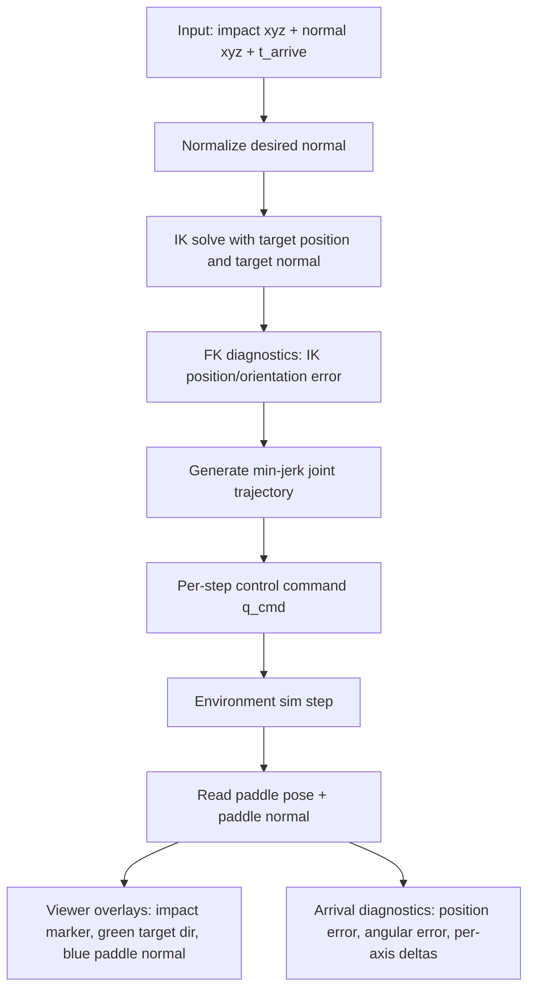
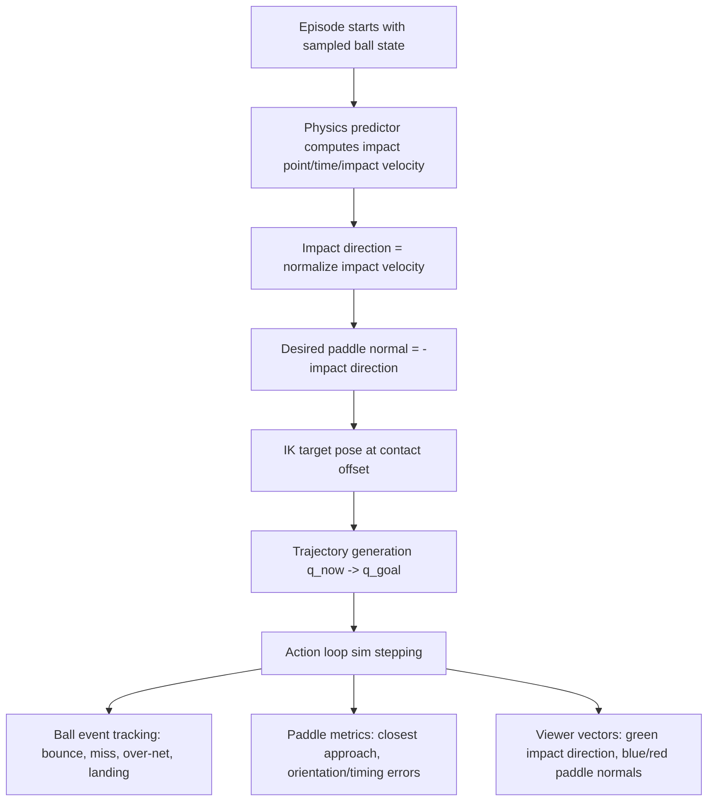
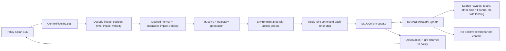
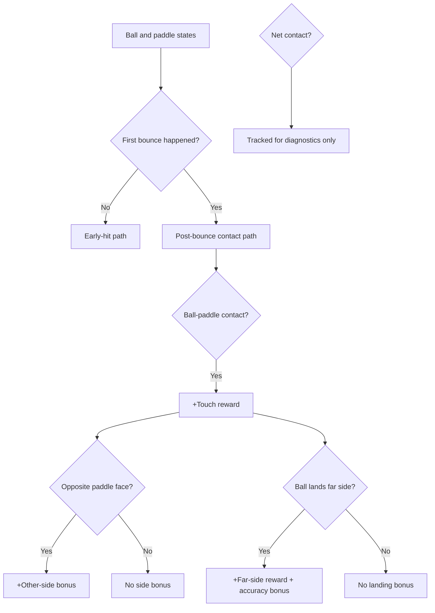

# Table Tennis Project Progress

Date: 2026-04-07

## 1) Original Plan (Start of Conversation)

The conversation began with a phased validation plan:

1. Move robot/base constants into config and consume them from code.
2. Build a focused paddle-alignment test for a world-frame impact point and desired normal.
3. Add visual debugging (impact marker + target direction + paddle normal) in viewer.
4. Verify end-to-end action loop behavior:
   - Inverse kinematics
   - Trajectory generation
   - Joint-level control tracking
5. Port successful action-loop behavior into RL training path.
6. Update reward shaping to match intended game objective.

## 2) Features Added Throughout This Conversation

### A. Configuration and Environment Wiring

- Added robot base position in config and wired it into environment initialization.
- Environment now reads/validates home pose from config.

Files involved:
- config/robot.yaml
- src/rl/gym_env.py

### B. Paddle Alignment Test Script (Dedicated Debug Script)

- Created and iterated scripts/test_paddle_alignment.py to:
  - command a world-frame impact target and normal,
  - run IK + trajectory + control execution,
  - report scalar and per-axis position/normal errors,
  - support viewer/headless usage.
- Added visual overlays:
  - yellow impact marker,
  - green desired direction arrow,
  - blue paddle-normal arrow anchored to paddle contact.
- Added diagnostics for stage-by-stage debugging:
  - IK solution error,
  - trajectory target error,
  - joint tracking error at arrival.

File involved:
- scripts/test_paddle_alignment.py

### C. IK/Control Loop Refinements

- Extended IK usage to support normal-constrained solving in the action loop.
- Control pipeline now derives paddle normal from impact velocity direction when available:
  - desired normal = -normalize(impact velocity)
  - falls back to action normal when velocity is near zero.

File involved:
- src/rl/control_pipeline.py

### D. Comprehensive Script Visualization + Impact Direction Logic

- Added in-view debug vectors to scripts/test_comprehensive.py.
- Green vector now represents impact-direction tangent to predicted ball trajectory.
- Blue + red vectors show both paddle-face normals.
- White paddle rendering added for visual contrast.
- Predictor return shape was made consistent (4-value contract in all branches).

File involved:
- scripts/test_comprehensive.py

### E. RL Reward Model Changes (Per New Objective)

Implemented reward logic updates requested later in the conversation:

- Positive reward remains for valid paddle hit and far-side landing.
- Added positive bonus for hit using the opposite paddle face.
- Removed positive reward for net contact.
- Over-net transition is still tracked, but not positively rewarded.

Files involved:
- src/rl/reward.py
- src/rl/gym_env.py
- scripts/train_rl.py (evaluation metrics now include other-side hit rate)

## 3) Clarifications/Behavior Verified During Conversation

- scripts/test_comprehensive.py currently reports a fixed denominator (9/9) because summary is test-category based, not episode-count based.
- In scripts/test_comprehensive.py, tested states are used with deterministic cycling over valid entries, not random sampling among valid entries.

## 4) Where We Are Right Now

### Completed

- Config-driven base/home setup integrated.
- Dedicated alignment tool exists with rich diagnostics.
- Comprehensive visual debug overlays exist (impact direction + both paddle-face normals).
- RL action loop updated to use impact-velocity direction for target normal.
- RL reward model updated to:
  - reward post-bounce hits,
  - reward far-side landing,
  - add other-side-face hit bonus,
  - remove net-positive reward.

### Current Known Caveats

- Viewer teardown on this Linux/Wayland setup can still trigger GLFW/EGL instability in some runs (intermittent segfault behavior observed in interactive scripts).
- Controller-gain tuning attempts were made for alignment tracking, but this remains environment-dependent and should be re-validated on your machine with viewer enabled.

## 5) Suggested Next Validation Pass (Optional)

1. Run scripts/test_paddle_alignment.py for a matrix of normals and record IK/tracking errors.
2. Run scripts/test_comprehensive.py and confirm visual vectors align with expected impact dynamics.
3. Launch a short RL training run (scripts/train_rl.py) and inspect metrics:
   - hit_rate
   - other_side_hit_rate
   - land_rate
   - net_rate (diagnostic only)
4. If needed, tighten reward magnitudes after first learning curve review.

## 6) Diagrams

### A. Alignment Test Action Loop (scripts/test_paddle_alignment.py)

### B. Comprehensive Script Data/Decision Flow (scripts/test_comprehensive.py)

### C. RL Training Loop (train_rl.py + gym_env.py + control_pipeline.py)

### D. Reward Event Logic (Current)

